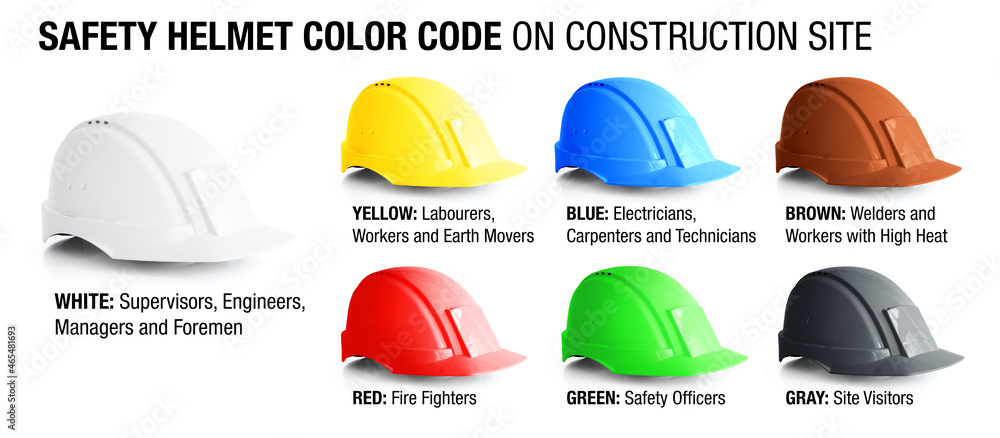

# 🪖 Helmet Detection System with Color Identification

A real-time helmet detection system using YOLOv8 that identifies whether workers are wearing helmets and determines the helmet color for safety compliance.

---


## 🎯 Features

✅ **Real-time Detection** - Live camera feed processing  
✅ **Upload Support** - Process images and videos  
✅ **Color Identification** - Detects helmet colors by using open cv and kmeans for clustring
✅ **Confidence Score** - Shows detection confidence percentage  
✅ **streamlit UI** - deploying the model to streamlit for ease use to user 

---

## 🚀 Installation

### 1. Create Virtual Environment
```bash
python -m venv venv
```

### 2. Activate Environment
**Windows:**
```bash
venv\Scripts\activate
```


### 3. Install Dependencies
```bash
pip install -r requirements.txt
```

---

---

## ▶️ How to Run

```bash
streamlit run app.py
```

The app will open in your browser at `http://localhost:####`
demo of UI


---

## 📁 Project Structure

```
Helmet-Detection-with-colors/
├── app.py    # Main application
├── best.pt                         # YOLOv8 trained model
├── logo.webp                       # Company logo (optional)
├── background.png                  # Background image (optional)
└── requirements.txt                # Python dependencies
```


##  Usage

### Real-Time Camera Mode
1. Click **"Real-Time Camera"** button
2. Allow camera access
3. The system will detect helmets in real-time
4. Click **"Stop Camera"** to end

### Upload Mode
1. Click **"Upload Image / Video"** button
2. Select an image (JPG/PNG) or video (MP4/AVI)
3. View detection results with bounding boxes
4. For videos, see detection statistics

---

## 🔧 Key Improvements Made

### 1. **Proper YOLO Integration**
- Removed hardcoded detection results
- Integrated actual model predictions
- Processes bounding boxes correctly

### 2. **Color Detection Algorithm**
```python
def get_dominant_color(image_region):
    # Filters out shadows and highlights
    # Calculates mean color from valid pixels
    # Classifies into 8 common helmet colors
```

### 3. **Enhanced Features**
- Automatic camera index detection (tries 0, 1, 2)
- Progress bar for video processing
- Video statistics and summary
- Error handling for missing files
- Graceful fallbacks

### 4. **Performance Optimizations**
- Model caching with `@st.cache_resource`
- Frame skipping for video processing
- Efficient color calculation


## 🎓 For PETROCHOISE Interview

### What This Demonstrates:
1. **Computer Vision Skills** - YOLOv8 integration, OpenCV processing
2. **Color Analysis** - Custom algorithm for helmet color classification
3. **UI/UX Design** - Professional Streamlit interface
4. **Code Quality** - Clean, documented, maintainable code
5. **Problem Solving** - Handles edge cases, errors, multiple modes

### Key Technical Points:
- Efficient pixel filtering (removes shadows/highlights)
- RGB color space analysis
- Real-time processing optimization
- Video frame sampling for performance
- Robust error handling


## 🔮 Future works

- [ ] Multiple helmet detection in one frame
- [ ] Person tracking across video frames
- [ ] Safety violation alerts
- [ ] Database logging of detections
- [ ] Export detection reports
- [ ] Mobile app version


## 👤 Author

mohamed ibrahim - Helmet Detection System  
For: PETROCHOISE Company 

